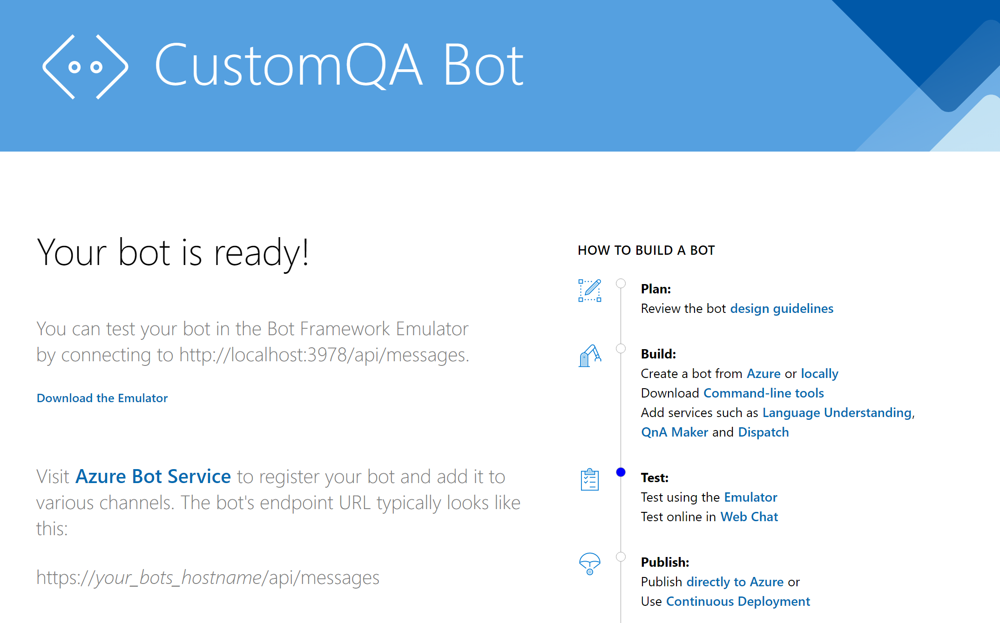

##Deployment

Download or clone this repo

```shell
git clone https://github.com/ronikurnia1/CustomQABot.git
```
Change **languageProjectName** and **appName** parameters with a uniqe short name (initial) in the **~/CustomQABot/Bicep/main.parameters.json** file

```json
{
  "$schema": "https://schema.management.azure.com/schemas/2015-01-01/deploymentParameters.json#",
  "contentVersion": "1.0.0.0",
  "parameters": {
    "languageProjectName": {
      "value": "[your-uniqe-language-project-name]"
    },
    "appName": {
      "value": "[your-uniqe-app-name]"
    },
    "languageSku":{
      "value": "F0"
    },
    "searchSku":{
      "value": "free"
    },
    "appServicePlanSku":{
      "value": "F1"
    },
    "azureBotSku":{
      "value": "F0"
    }
  }
}
```

Use Azure CLI to deploy the resources

```shell

az login --tenant "[your-tenant-id]"

$rgName="[your-resource-group-name]"
$location="[azure-location]"

az group create --location $location --name $rgName
az deployment group create --resource-group $rgName --template-file main.bicep --parameters main.parameters.jsonv --yes
```

Wait for about 5-10 minutes for the deployment of azure resources and app to complete

When it completed you can try to access the app at **https://[your-uniqe-app-name]-webapp.azurewebsites.net**, see if it's working



